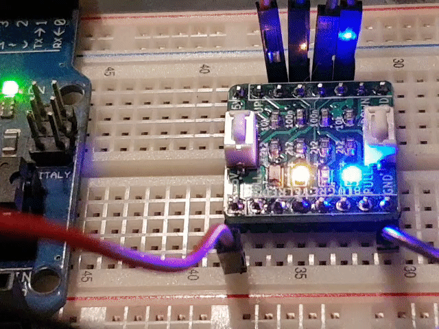

[](https://github.com/berrak/LedTask/blob/master/LICENSE)
[](https://www.ardu-badge.com/LedTask)
[](https://github.com/berrak/LedTask/releases/latest)
[](https://github.com/berrak/LedTask/releases/latest)
[](https://github.com/berrak/LedTask/stargazers)
[](https://github.com/berrak/LedTask/issues)
[](http://berrak.github.io/LedTask/)

# Arduino library LedTask
The Arduino library `LedTask` shows the power of non-preemptive multitasking. `LedTask` shows an elementary example with four LEDs, and these run close to independent of each other. 

## Why try this library?

- `try it and modify` the source code for exploration.
- use it as a starter and move on to a more `sophisticated variant` like [Makuna Task](https://github.com/Makuna/Task) 
- `get inspired` and explore what more Arduino has to offer. Search in Library Manager - for `multitask`.

The purpose of this library is to be a practical eye-opener and encourage writing Arduino code differently without inefficient `delay()` calls.

## Library user interface changes

See below for the latest version of available public [methods](https://github.com/berrak/LedTask#library-methods). The library API changed in release v0.2.0.  

## Set up an Arduino Uno or any other microcontrollers

Connect either four individual LEDs with a limiting 1 kohm resistor to VCC, or get yourself the breadboard-friendly tiny `LEDs and switches, break-out board`. Please see below for how to purchase it.

| Platform | Digital Pin# | Led# Cathode |
|-|-|-|
| Arduino Uno | 12 | Led1 |
| Arduino Uno | 13 | Led2 |
| Arduino Uno |  8 | Led3 |
| Arduino Uno |  7 | Led4 |

Find four free digital pins for any other microcontrollers and adjust them in the Arduino example sketch.

## Run the example

In the Arduino IDE, scroll down the long list below `File->Examples` and find `LedTask`.
Upload the code, and the four LEDs flash seemingly independently of each other. 

Each instance of a LedTask requires just three lines of code:

- one to declare the instance
- one to setup timing in setup
- and one call to update in the loop

```cpp
LedTask LedOne = LedTask(12);
void setup() {
//                 on_ms,off_ms
	LedOne.begin(100, 400);
}
void loop() {
	LedOne.updateBlinkLed();
}
```

## Documentation (GitHub Pages - Doxygen)

[Library documentation](https://berrak.github.io/LedTask/classLedTask.html).

## How to Install

Click on the green `Library Manager` badge above for instructions,
or use the alternative manual installation procedure.

1. Navigate to the [Releases page](https://github.com/berrak/LedTask/releases).
1. Download the latest released ZIP-archive in `~/Arduino/libraries`.
1. Unzip the archive.
1. Rename the new directory. Remove *version-code*, or *master* in the name like this for `LedTask`.
1. Restart Arduino IDE.
1. In Arduino IDE scroll down the long list below `Sketch->Include Library` and find `LedTask`.

## Do you liked the tiny breadboard friendly 'LEDs, and switches break-out board'?

You can purchase all the latest designed boards on `Tindie`. 

[](https://www.tindie.com/stores/debinix/)

We appreciate your support.

## Starting point and credits
For a good starting point for understanding non-preemptive multitasking, thank `Bill Earl` and his write-up on the subject in his [article](https://learn.adafruit.com/multi-tasking-the-arduino-part-1?view=all).
